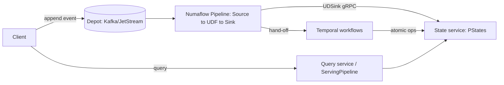

# PRD — Numaflow + Go/Temporal Hybrid Runtime

## Objective

Deliver the same product behavior specified in the parent [`../PRD.md`](../PRD.md)
(the six Rama gallery examples and the RamaSpace capstone) using **Numaflow** as the
streaming/ETL runtime and a **Go + Temporal** layer for everything Numaflow does not
provide: durable queryable state (PStates), rich queries, cross-partition
transactions, per-partition ordering guarantees, atomic conditional writes, and
schema migrations.

This document defines *what* the hybrid system must do and how responsibility is
split. The *how* (component design) lives in [`TECHSPEC.md`](./TECHSPEC.md). No code
is implemented at this stage; `pipelines/*.yaml` are configuration only.

## Source Material and Precedence

1. [`../AGENTS.md`](../AGENTS.md) contains mandatory project rules and overrides this
   document if they conflict.
2. [`../PRD.md`](../PRD.md) is the canonical behavioral spec; every acceptance case
   there remains an acceptance case here. This document only re-assigns *where* each
   behavior executes.
3. Numaflow behavior is grounded in its docs:
   [pipeline](https://numaflow.numaproj.io/core-concepts/pipeline/),
   [vertex](https://numaflow.numaproj.io/core-concepts/vertex/),
   [reduce](https://numaflow.numaproj.io/user-guide/user-defined-functions/reduce/reduce/),
   [serving](https://numaflow.numaproj.io/core-concepts/serving/),
   [side inputs](https://numaflow.numaproj.io/user-guide/reference/side-inputs/),
   and the delivery/ordering guarantees on the [home page](https://numaflow.numaproj.io/).

## System Overview

The hybrid system is four cooperating parts:

1. **Numaflow pipelines** (Kubernetes CRDs) — depots (Sources over Kafka/JetStream),
   ETLs (map/reduce UDFs), and delivery to sinks. The Numaflow controller owns module
   lifecycle, liveness, autoscaling, and rolling updates.
2. **State service (`stated`)** — a Go process exposing gRPC that implements the
   **PState** abstraction: typed, partitioned, indexed, queryable materialized views
   with atomic conditional writes. UDF/UDSink containers are thin clients of it.
3. **Temporal control plane** — Go workflows for multi-step, cross-partition, or
   long-running operations that require atomicity or coordination: transfer sagas,
   friend-accept transactions, and schema migrations.
4. **Query service** — a Go HTTP/gRPC service (optionally fronted by a Numaflow
   `ServingPipeline`) that answers point/range/paginated queries from the State
   service without transferring unbounded state to clients.

## Responsibility Split (normative)

| Behavior class | Runs on | Notes |
|---|---|---|
| Durable append + replay of depots | Numaflow Source + Kafka | replay = re-consume topic |
| Per-record stream ETL | Numaflow map UDF | conditional forwarding for branches |
| Windowed / microbatch aggregation | Numaflow reduce UDF | fixed/sliding/session/accumulator |
| Exactly-once *transport* | Numaflow (unbounded sources) | plus idempotent sink effects |
| Queryable materialized views (PStates) | State service | the core missing piece |
| Point / range / paginated queries | Query service (+ ServingPipeline) | server-side reduction, no full scans |
| Atomic conditional write (unique claim, CAS) | State service | single-key atomicity |
| Cross-partition / multi-key transaction | Temporal workflow | saga + compensation |
| Per-partition ordering guarantee | Go layer (keyed routing + seq + reorder) | Numaflow does not guarantee order |
| Schema/PState migration + version coexistence | Temporal workflow + Numaflow update strategy | dual-read compatibility window |

## Gap Requirements (what Go/Temporal must add)

### G1 — PState (queryable materialized views)
- Typed, partitioned key/value views supporting scalar, map, set, list, fixed-key
  record, and nested schemas.
- Subindexed sorted maps/sets for bounded page and range reads.
- Local atomic transforms and aggregations per key.
- Idempotent-by-`eventId` writes so replayed Numaflow messages produce exactly-once
  effects.
- **Storage tiering (see [TECHSPEC §3.1](./TECHSPEC.md)):** the same PState contract
  is served by **Pebble** for stream/hot state (MVP, per-record durable, immediate
  read-after-write) and by **IsleDB on R2/S3/MinIO** for microbatch/large/range state
  (scale-out, object-storage durability, second-scale freshness). Atomicity is
  provided by the single owning writer per partition, not the engine; enabling the
  IsleDB tier is gated by the **S1 spike** (§Delivery Phases).

### G2 — Queries
- Point (get profile, get password hash, friendship-exists), range (time-series,
  profile-view hour sums), and paginated (posts, friends, requests — pages of ≤20)
  queries.
- Large collections MUST be paged or reduced server-side; a query MUST NOT transfer
  an entire unbounded PState to the client.

### G3 — Atomic conditional writes
- `claimIfAbsent(username) -> userID | duplicate` with no check-then-append race.
- `createIfAbsent(userID, profile)` persisting the winning registration UUID.

### G4 — Cross-partition transactions
- Bank transfer: conditional debit (only if funds available) + credit on another
  partition, consistent outgoing/incoming indexes, balance preserved on failure,
  idempotent by `transferId`, exactly-once effect.
- Friend accept: one logical event clears pending requests in both directions and
  creates the friendship edge in both directions, atomically.

### G5 — Ordering
- Where correctness depends on append order (friend request vs cancel for one
  initiator), the system MUST process events for that key in append order despite
  Numaflow not guaranteeing order across partitions.

### G6 — Migrations
- Typed PState schema migration that is idempotent and resumable.
- Existing records migrated to the new schema; new records written directly in the
  new schema; old and new module versions coexist during rollout.

## Per-Scenario Behavior (mapping to manifests)

Each scenario preserves the acceptance behavior of the parent PRD; only execution
placement changes. Manifests live in [`pipelines/`](./pipelines).

### Session 1 — Profiles (`session-1-profiles.yaml`)
- Numaflow: ingest registrations (keyed by username) and edits (keyed by userID);
  repartition username→userID across vertices.
- Gaps: **G3** atomic username claim + userID generation; **G1** `profiles` PState;
  partial edits preserve untouched fields; **G2** profile/password-hash queries.
- Storage: **Pebble (stream/hot)** in both phases; not moved to IsleDB.

### Session 2 — TimeSeries (`session-2-timeseries.yaml`)
- Numaflow: fixed-window reduce combiners at minute/hour/day/30-day granularities,
  keyed by URL, chained coarser-from-finer; event-time based.
- Gaps: **G1** sorted range index; **G2** range queries; unit-test the combiner
  independently of the runtime (parent PRD §Session 2).
- Storage: functional on **Pebble (Phase 1)**; large/long-retention range index and
  30-day TTL delivered on **IsleDB (Phase 2, gated by S1)**.

### Session 3 — TopUsers (`session-3-topusers.yaml`)
- Numaflow: keyed accumulator reduce for per-user spend; single global partition for
  the ranking.
- Gaps: **G1** durable monotonic top-500 PState; **G2** top-N query with server-side
  userID projection.
- Storage: **Pebble** (bounded top-500 + per-user spend are small/hot); IsleDB not
  required.

### Session 4 — BankTransfer (`session-4-banktransfer.yaml`)
- Numaflow: durable ingest + dedup fan-out only.
- Gaps: **G4** transfer saga (the substance of the example); **G1** balances +
  transfer indexes; **G3/exactly-once** idempotency by `transferId`.
- Storage: **Pebble** (balances are small/hot and need CAS-style conditional debit
  via the single owner + Temporal); IsleDB not required.

### Session 5 — RestAPI (`session-5-restapi.yaml`)
- Numaflow: map UDF async HTTP I/O keyed by URL; Side Inputs for rotating config;
  latest-response UDSink.
- Gaps: **G1** latest-response PState; **G2** latest-response query. Tests use an
  in-process fake / `httptest.Server`; no public-internet dependency (parent PRD).
- Storage: **Pebble (stream/hot)**; IsleDB not required.

### Session 6 — MusicCatalog (`session-6-musiccatalog.yaml`)
- Numaflow: live pipeline update under a stable name; blue/green version coexistence.
- Gaps: **G6** typed catalog schema migration via Temporal; dual-read window.
- Storage: **Pebble** for MVP; if the catalog is placed on **IsleDB (Phase 2)** the
  migration workflow rewrites the object-storage keyspace, still gated by S1.

### Capstone — RamaSpace (`ramaspace.yaml`)
- Numaflow: users stream, friends stream, posts microbatch, profile-views microbatch,
  and a `ServingPipeline` for resolve-posts.
- Gaps: all PStates (**G1**), friend-accept transaction (**G4**), request/cancel
  ordering (**G5**), pagination and range sums (**G2**), server-side author
  enrichment in resolve-posts.
- Storage: profiles + friends/requests on **Pebble (stream/hot)** in both phases;
  **posts** and **profile-views** (microbatch, unbounded, range-scanned) delivered on
  **IsleDB (Phase 2, gated by S1)**. Functionally complete on Pebble in Phase 1.

## Tutorial Progression (1–6)

The tutorials are a *teaching* order, not separate deployables; each is demonstrated
with a subset of the manifests above.

| Tutorial | Demonstrated with | Hybrid teaching point |
|---|---|---|
| 1 — First Module | a trimmed `session-1` | pipeline = module; Source = depot append; UDF = ETL; ServingPipeline = query |
| 2 — Depots/ETLs/PStates | `session-2` + State service | ETL is the only writer to a PState; rebuild PState by replaying the Kafka depot (or, Phase 2, the IsleDB change feed — gated by S1) |
| 3 — Distributed programming | `ramaspace-friends` | keyed partitioning + **G5** ordering; co-location = the single State-service writer per partition; scaled readers are a Phase 2 / IsleDB (S1) capability |
| 4 — Dataflow programming | `session-1` branches + `ramaspace-resolve-posts` | map fan-out, conditional forwarding, Join vertex, cycles |
| 5 — Stream vs microbatch | `session-1` (stream, Pebble) vs `ramaspace-posts` (reduce, IsleDB in Phase 2) | at-least/at-most-once stream vs exactly-once committed batch |
| 6 — RamaSpace | `ramaspace.yaml` | full capstone (Pebble Phase 1; posts + views on IsleDB in Phase 2) |

## Testing and Acceptance

All acceptance cases from parent PRD §Testing and Acceptance apply. Additional
hybrid-specific requirements:

- **Determinism without external services (unit/integration):** the State service and
  Temporal workflows MUST be testable in-process (Temporal Go `testsuite`,
  `RegisterDelayedCallback` for the 30s microbatch boundary and one-minute liveness).
  Numaflow itself is NOT required for unit/integration tests — UDF/UDSink logic is
  tested against a fake message context and the in-process State service.
- **Numaflow in the loop only for E2E:** full end-to-end tests may stand up a
  Numaflow pipeline (and Temporal Test Server) only after unit and integration suites
  pass, consistent with parent AGENTS.md.
- **Ordering test (G5):** interleave request/cancel for one initiator across restarts
  and assert append-order processing.
- **Transaction tests (G4):** inject failure between debit and credit / between the
  two friendship sides and assert no partial state, exactly-once on retry.
- **Migration test (G6):** run the migration workflow with an injected mid-run crash
  and assert idempotent completion with existing + new records in the new schema.
- **S1 storage-spike tests ([TECHSPEC §12](./TECHSPEC.md)):** before enabling the
  IsleDB tier, prove Gate A/B/C (flush-as-commit == exactly-once checkpoint, fenced
  writer takeover, pagination/snapshot, retention/replay) against a local `file://`
  bucket and MinIO. These are the only tests permitted to touch object storage, and
  none run in the unit/integration suites.

## Delivery Phases and the S1 Storage Gate

The hybrid is delivered in two phases with an explicit gate between them, so the
storage engine choice never blocks *functional* progress but the *scale-out* behavior
the examples teach is still delivered.

### Phase 1 — MVP on Pebble (no object storage)

- The State service runs single-node on the **Pebble** tier (with the in-memory tier
  for tests), behind the gRPC contract.
- **Every session and RamaSpace is functionally complete on Pebble**: all G1–G6
  acceptance cases (registration, edits, top-N, transfers, migrations, pagination,
  range sums) pass on unit/integration harnesses without any object storage.
- Microbatch PStates commit via Pebble's synced batch (one commit = PState mutations
  + dedup marker + input high-watermarks + checkpoint).

### S1 Gate — IsleDB compatibility spike (MUST pass before Phase 2)

- Enabling the **IsleDB** (R2/S3/MinIO) tier is **gated** by the S1 spike defined in
  [TECHSPEC §12](./TECHSPEC.md). S1 MUST prove, behind the storage interface:
  - **Gate A** — `Get`/`Put`/`RangeGet` conformance; `Flush()` == the exactly-once
    microbatch checkpoint (crash-before-flush replays; committed-batch retry is a
    no-op); cursor/snapshot pagination; owner read-after-commit.
  - **Gate B** — fenced writer takeover on partition hand-off (no split-brain);
    independent scaled readers with a documented freshness policy; the
    one-writer-per-partition invariant enforced by the control plane.
  - **Gate C** — out-of-process compaction/GC/retention (30-day TTL) and, optionally,
    change-feed replay for "rebuild PState by replay."
- **Fallback (no gap):** if any Gate-A invariant fails, the MVP remains **Pebble-only**
  and Tier 2 is deferred. Because handlers speak only the storage contract, this costs
  no application changes; only large-capacity/scale-out demos are postponed.

### Phase 2 — Scale-out on IsleDB (after S1 passes)

The following behaviors, which the gallery/tutorials exist to teach, are delivered on
the IsleDB tier and therefore **depend on the S1 gate**:

| Behavior needing Tier 2 | Scenario | Why Pebble alone is insufficient |
|---|---|---|
| Large/long-retention range index (minute→30-day) | Session 2 | object-storage capacity + 30-day TTL retention |
| Reverse-chronological post archives at scale | RamaSpace posts | unbounded per-wall growth, object-storage durability |
| Hour-bucket view analytics at scale | RamaSpace profile-views | unbounded buckets, second-scale freshness acceptable |
| Independent scaled query readers | `queryd` / Tutorial 3 | many readers without DB replicas (fenced-writer + reader model) |
| "Rebuild PState by replay" from the store | Tutorial 2 | IsleDB change feed (or Kafka re-consume) |

Stream/hot PStates (profiles, friend sets — Sessions 1/5, RamaSpace users/friends)
remain on **Pebble** in both phases; they are not moved to IsleDB.

## MVP Boundaries

- **Phase 1 = Pebble only.** Start with a single-node State service (in-memory or
  Pebble) behind the gRPC contract; the IsleDB tier and distributed/sharded State
  service are **Phase 2**, gated by S1 (above).
- Begin with a configurable 30-second microbatch window; tests use virtual time.
- Temporal is required for the transaction/migration scenarios and their tests; it is
  not used for individual dataflow operations (consistent with parent PRD).
- Numaflow manifests target a local `numaflow` install (e.g. kind/k3d) for E2E; local
  dev may use the `http` source variants instead of Kafka.
- Object storage for E2E is MinIO locally (offline, deterministic) and R2/S3 in cloud
  CI; no unit/integration test depends on object storage or the public internet.
