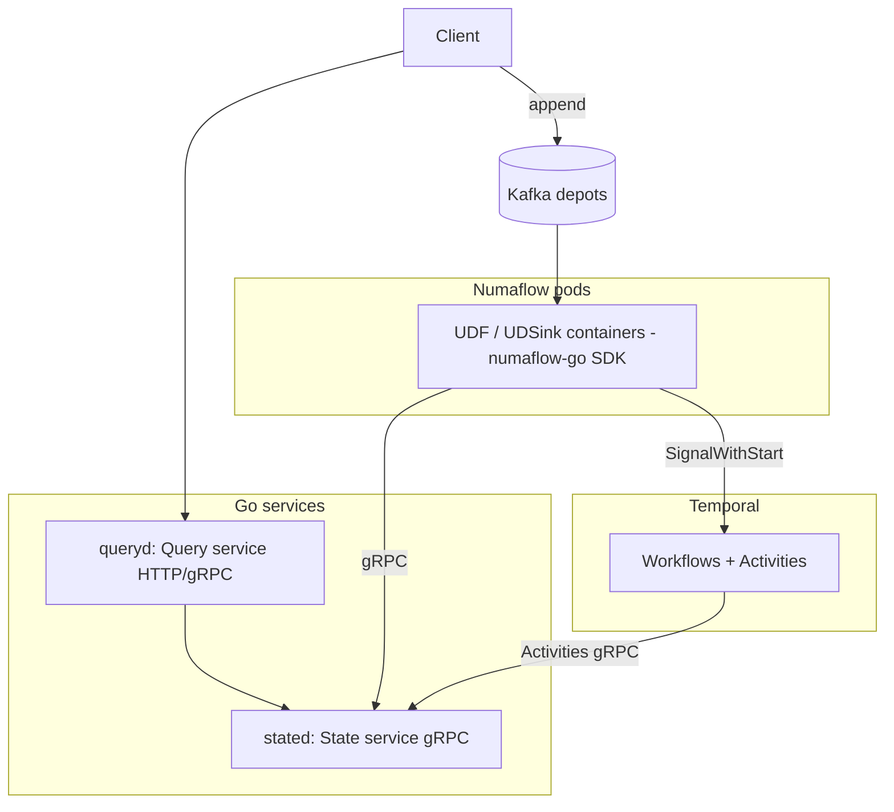

# TECHSPEC — Numaflow + Go/Temporal Hybrid Runtime

Implementation design for the gaps identified in [`PRD.md`](./PRD.md). This is a
**design document; no code is implemented yet.** It specifies the Go components,
their contracts, and how Temporal covers cross-partition/multi-step behavior, while
Numaflow (config in [`pipelines/`](./pipelines)) owns transport and ETL.

Follows [`../AGENTS.md`](../AGENTS.md): Go 1.27.x, stdlib-first, concrete structs with
first-class function fields (avoid interfaces unless a dependency/protocol boundary
requires one — gRPC service boundaries qualify), structured logging, `testing/synctest`
and Temporal `testsuite`/`RegisterDelayedCallback` for determinism.

## 1. Component Topology



Processes (all Go binaries, per AGENTS.md "fully testable standalone"):

| Binary | Role | Talks to |
|---|---|---|
| `stated` | PState store (G1/G2/G3) | embedded storage (Pebble/in-mem) |
| `queryd` | query API (G2) | `stated` |
| `worker` | Temporal worker: workflows + activities (G4/G6) | `stated`, Temporal |
| UDF/UDSink images | thin Numaflow handlers | `stated`, Temporal (start only) |

## 2. Event Envelope

Every Numaflow message payload is a canonical envelope; the source `transformer`
normalizes inbound data into it and extracts event time.

```go
// design sketch — not implemented
type Envelope struct {
    EventID   string          // idempotency key (ULID)
    Type      string          // e.g. "UserRegistration"
    Key       string          // partition/routing key (e.g. userID)
    EventTime int64           // ms epoch
    Seq       int64           // per-Key monotonic sequence (ordering, G5)
    Payload   json.RawMessage // typed body, validated by the UDF
}
```

- `EventID` drives exactly-once effects in `stated` (see §3.3).
- `Seq` is assigned at append time by the ingesting client/edge service and used by
  the ordering strategy (§6).

## 3. State service (`stated`) — the PState layer (G1, G2, G3)

`stated` is the substitute for Rama PStates. Numaflow's reduce PVC is checkpoint/replay
storage only, per its docs, so it cannot serve queries; `stated` fills that role.

### 3.1 Storage tiers (in-memory → Pebble → IsleDB on R2/S3)

`stated` is defined by the storage **contract** (§3.3), not a backend. Three tiers
implement that contract, chosen per PState and per milestone. This extends the parent
[`../TECHSPEC.md`](../TECHSPEC.md) storage decisions.

| Tier | Engine | Role | Durability / visibility boundary |
|---|---|---|---|
| 0 | in-memory | tests, executable spec | immediate |
| 1 (MVP) | **Pebble** (pure Go, `CGO_ENABLED=0`) | authoritative write path; stream PStates; CAS/idempotency | synced indexed batch (fsync) |
| 2 (scale-out) | **IsleDB** on R2/S3/MinIO (pure Go) | capacity + durability tier; microbatch/large/range PStates; independent read scaling | writer `Flush()` |

**MVP: PState = Pebble.** Yes — Pebble is the MVP PState engine. A synced Pebble
indexed batch commits PState mutations + the dedup marker + input high-watermarks +
the checkpoint atomically (parent TECHSPEC §Microbatch Commit), which is exactly the
atomic unit our `Transform`/`ClaimIfAbsent`/microbatch commit need. It gives
read-after-write fast enough for the stream acceptance rule ("queryable immediately
after an acknowledged append").

**Scale-out: IsleDB for a distributed LSM over object storage.** IsleDB is a pure-Go
KV database for object storage (S3, GCS, Azure, MinIO, local) built on Pebble's SSTable
format, offering point reads, range scans, iterators, snapshots, TTLs, one **fenced
writer** + many independent readers, an optional writer-order **change feed**, and
out-of-process compaction ([README](https://github.com/ankur-anand/isledb),
[repo](https://github.com/ankur-anand/isledb)). Cloudflare **R2 and AWS S3** are both
reachable through its `gocloud.dev/blob` `s3://` driver (R2 via an S3-compatible
endpoint override); R2's zero egress fees make it attractive for the reader-cache
refresh pattern.

**Why IsleDB is NOT a drop-in for Pebble (the key caveat).** IsleDB explicitly does
*not* provide compare-and-swap, multi-key transactions, secondary indexes, or
sub-10 ms read-after-write; its fit is "second-scale freshness" with `Flush` as the
visibility boundary ([README §When IsleDB fits](https://github.com/ankur-anand/isledb)).
Our design absorbs this because **atomicity lives in the application layer, not the
storage engine**: every PState partition has exactly one owning task/writer (Rama
co-location; §6 ordering). That single-writer-per-prefix model — which also matches
IsleDB's fenced-writer requirement — means we get serialized read-modify-write and
CAS semantics from the *owner*, and the store only needs durable ordered KV + range
scans, which IsleDB has. Cross-partition atomicity still goes through Temporal (§5),
never the storage engine.

**Stream vs microbatch tiering (the natural fit).**
- **Stream PStates** (profiles, friend sets — need per-record low-latency durability
  and immediate read-after-write) → **Pebble**. Per-record object-storage flushes
  would be too slow, so streams stay on the local synced engine.
- **Microbatch PStates** (time-series rollups, posts, profile-view buckets — one
  commit per 30 s batch, second-scale freshness acceptable, large + range-scanned)
  → **IsleDB**: one `Writer.Flush()` per microbatch *is* the exactly-once commit
  boundary, mapping cleanly onto the batch checkpoint.
- The owning task serves its own partition's reads from an in-memory overlay + WAL
  before flush, so "queryable after commit" holds even under IsleDB's async visibility;
  remote readers (queries, cross-partition enrichment) accept second-scale freshness
  and call `Refresh` when they must see the latest committed write.

**IsleDB change feed as optional CDC.** IsleDB's writer-order change feed (keys-only
or full-value, persistent cursor) can drive PState rebuild, cache invalidation, or a
secondary reader tier without re-reading Kafka — a candidate for the "rebuild PState
by replay" demo (Tutorial 2). Kept optional behind the contract.

**Why not SlateDB.** SlateDB is a comparable object-storage LSM but its engine is
Rust (Go access via FFI/CGO), which violates the `CGO_ENABLED=0`, pure-Go rule in
`../AGENTS.md`. IsleDB is preferred *because* it is pure Go; SlateDB is reconsidered
only if that constraint changes (consistent with parent TECHSPEC).

**Guardrails.** IsleDB is `v0.x`; it stays behind the `stated` contract until a
compatibility spike proves its flush/fence/replay/range/recovery invariants (parent
TECHSPEC S1). No correctness path may depend on unverified IsleDB behavior, and the
single-writer-per-partition invariant must be enforced by the control plane before
IsleDB is enabled.

### 3.2 PState kinds (typed, generic)
Concrete Go structs with function fields, parameterized by generics:

- `Scalar[V]` — single value per key.
- `KVMap[K,V]` — `map[key]V`.
- `SortedMap[K,V]` — subindexed ordered map (posts by postID, views by hourBucket,
  time-series by bucket) → supports `Range(from,to,limit,cursor)`.
- `SortedSet[E]` — subindexed ordered set (friends, incoming/outgoing requests) →
  supports paged reads and membership checks.
- `Record` — fixed-key typed record (profile).

Each PState is partitioned by key; the key owner serializes read-modify-write so
task-local atomic transforms are possible (emulating Rama co-location).

### 3.3 gRPC contract (boundary interface — allowed)
```protobuf
service State {
  rpc Get(GetReq) returns (GetResp);
  rpc Put(PutReq) returns (PutResp);              // idempotent by event_id
  rpc Transform(TransformReq) returns (TransformResp); // atomic RMW per key
  rpc ClaimIfAbsent(ClaimReq) returns (ClaimResp);     // G3: unique claim
  rpc RangeGet(RangeReq) returns (RangeResp);          // G2: paged/range
}
```
- `Put`/`Transform` record `event_id` in a per-key dedup set → **exactly-once**
  effects even when Numaflow replays a message (at-least-once transport).
- `Transform` takes a named, registered transform function (server-side reduction) so
  large collections are mutated/aggregated without shipping them to the client.
- `ClaimIfAbsent` implements the atomic unique-username claim + userID generation.

### 3.4 Named transforms & aggregators
Registered by name (string) so UDFs stay thin and versionable:
`profileCreateIfAbsent`, `profilePartialEdit`, `friendReqAdd/Remove`,
`postAppend(assignPostID)`, `viewCountIncr(hourBucket)`, `topNMerge(500)`,
`tsCombine(count,total,latest,min,max)`. Each is pure and unit-testable in isolation
(satisfies parent PRD §Session 2 "unit test a custom operation independently").

## 4. Numaflow handlers (thin, `numaflow-go`)

UDF/UDSink containers contain no business state; they:
1. decode the `Envelope`,
2. call one `stated` RPC (or `Transform`), or start a Temporal workflow,
3. emit downstream messages / tags.

Handler logic is tested against a fake `Datum`/context and the in-memory `stated`
adapter, so **Numaflow is not needed for unit/integration tests** (AGENTS.md).

Mapping of Numaflow features used:
- **map UDF** → per-record ETL (register, apply-edit, dedup, fetch-url).
- **reduce UDF** → windowed aggregation (timeseries combiners, posts batch, view
  counts, per-user spend, global top-N). `storage:` is replay-only.
- **conditional forwarding (tags)** → branches (registered/duplicate, ok/error).
- **Join vertex / cycles** → unification and loops for Tutorial 4.
- **Side Inputs** → rotating REST config (Session 5).
- **ServingPipeline** → resolve-posts round trip (RamaSpace).

## 5. Temporal control plane (G4, G6)

Temporal handles what is multi-step, cross-partition, or long-running. It is invoked
from a UDSink via `SignalWithStartWorkflow` using a deterministic `WorkflowID` for
idempotency; it is **not** used per dataflow op (consistent with parent PRD).

### 5.1 Transfer saga (Session 4, G4)
`WorkflowID = "transfer-" + transferId` (dedupe). Steps as Activities against `stated`:
1. `ConditionalDebit(src, amount, transferId)` — CAS; fail if insufficient funds.
2. `Credit(dst, amount, transferId)`.
3. `WriteTransferIndexes(src, dst, status)` (outgoing + incoming, success/failure).
4. Compensation: if step 2/3 fails after debit → `Credit(src, amount)` refund; record
   `failed`; balances preserved.
All Activities are idempotent by `(transferId, step)` keys → exactly-once effect on
retries. Deterministic tests via Temporal `testsuite`; failures injected between
steps with `RegisterDelayedCallback`.

### 5.2 Friend-accept transaction (RamaSpace, G4)
`WorkflowID = "friendship-" + eventId`. One workflow clears both pending-request sets
and adds both friendship edges (or removes both on unfriend) via `stated.Transform`
activities, atomically and idempotently.

### 5.3 Schema migration (Session 6, G6)
`MigrateCatalogV1toV2` workflow:
1. enumerate v1 keys in `stated` (cursor-checkpointed via workflow state / continue-as-new),
2. per batch, `Transform` v1→v2 idempotently,
3. new writes already land as v2 (writer image `:v2`); readers accept v1+v2 during the
   window,
4. on completion, flip a `schemaReady=v2` flag consumed by readers.
Version coexistence uses Numaflow blue/green pipelines (two Kafka consumerGroups) +
the `updateStrategy` in `session-6-musiccatalog.yaml`. Mid-run crash is injected in
tests to prove idempotent resume.

### 5.4 What Temporal does NOT do
No per-record ETL, no PState reads for queries, no windowing — those stay in Numaflow
and `stated`. This preserves the parent constraint: "Temporal MUST NOT execute each
dataflow operation."

## 6. Ordering strategy (G5)

Numaflow states order preservation is not required. Where append order matters
(friend request vs cancel for one initiator):

1. **Keyed depot partitioning** — hash by initiatorID so all related events land on
   one Kafka partition (preserves source order into the pipeline).
2. **Monotonic `Seq`** per key stamped at append.
3. **Reorder guard in `stated`** — `Transform` for an ordered PState rejects/queues an
   event whose `Seq` is not `lastSeq+1` for that key, applying a small bounded reorder
   buffer. This makes the final PState effect order-correct regardless of intra-pipeline
   reordering.

Single-partition edges are used only where global order is unavoidable (global top-N).

## 7. Query service (`queryd`) (G2)

- HTTP+gRPC facade over `stated` `Get`/`RangeGet`; performs server-side reduction
  (counts, sums, top-N projection) so unbounded state never crosses to the client.
- Round-trip queries that must run *inside* the streaming fabric (resolve-posts, which
  enriches from `profiles`) are exposed via the Numaflow **ServingPipeline**
  (`ramaspace-resolve-posts`) whose UDSink returns results with `ResponseServe`.
- Query catalog mirrors parent PRD §Required RamaSpace Queries: register result,
  password hash, public profile, incoming/outgoing request pages, friend count &
  existence, friends page, post count, resolve posts page, profile-view range sum.

## 8. Storage & serialization

- Reuse parent TECHSPEC key-layout and serialization/compatibility rules for `stated`
  so PState keys are consistent and range scans are efficient across both the Pebble
  and IsleDB tiers (§3.1).
- The `stated` contract (§3.3) is backend-neutral: the same `Get`/`Put`/`Transform`/
  `ClaimIfAbsent`/`RangeGet` semantics are served by in-memory, Pebble, or IsleDB.
  A PState declares its tier (`pebble` for stream/hot, `isledb` for microbatch/cold)
  in module metadata; the engine choice never changes handler code.
- Deterministic serialization (stable field order) for envelopes and PState values so
  dedup and idempotency keys are stable across versions.
- Because IsleDB reuses Pebble's SSTable format, key-encoding and range-order rules are
  shared between tiers, minimizing the compatibility surface for a future tier swap.

## 9. Testing strategy

| Layer | Harness | External deps |
|---|---|---|
| Named transforms/aggregators | pure Go table tests, ≥80% | none |
| UDF/UDSink handlers | fake Datum + in-mem `stated` | none |
| `stated` (dedup, range, CAS, reorder) | in-mem + Pebble | none |
| Temporal workflows (saga, migration) | Temporal `testsuite`, `RegisterDelayedCallback` | none |
| Query service | in-mem `stated` | none |
| End-to-end | `numaflow` on kind/k3d + Temporal Test Server | Numaflow, Kafka, Temporal |

E2E runs only after unit + integration pass (AGENTS.md). Microbatch boundaries and
one-minute liveness are simulated with virtual time, never real sleeps.

## 10. Dev workflow (mise / overmind / air)

Per AGENTS.md per-session convention, extend for the hybrid:
- `Procfile.numaflow-<scenario>` processes: `stated` (air), `worker` (air),
  `queryd` (air), and `numaflow` port-forward / `kafka` (dev).
- `.air.toml` per binary under `cmd/<binary>/`.
- `mise run numaflow:<scenario>:dev` runs `overmind start -f Procfile.numaflow-<scenario>`.
- Numaflow manifests applied via `kubectl apply -f NUMAFLOW/pipelines/<scenario>.yaml`
  against the local cluster (a `mise` task wraps this).

## 11. Open decisions

- State service sharding model for multi-process scale-out (parent TECHSPEC S3/S4);
  with IsleDB this reduces to "one fenced writer per PState partition prefix + N
  reader replicas," but the partition-ownership/fencing controller is undesigned.
- IsleDB compatibility spike is now scheduled as **S1** with concrete gates (§12);
  the open question is only the pass/fail outcome and the Pebble-only fallback trigger.
- Freshness policy for remote readers/queries against IsleDB (view refresh cadence vs
  explicit `Refresh`) and how it interacts with the "queryable after commit" rule for
  cross-partition reads.
- Whether to adopt the IsleDB change feed for the "rebuild PState by replay" demo vs
  re-consuming the Kafka depot.
- R2 vs S3 vs MinIO as the default object-storage target for E2E (R2 for zero egress;
  MinIO for fully local, offline E2E).
- Whether `queryd` and the ServingPipeline share one query core or diverge.
- Kafka vs JetStream as the default depot for the workshop (JetStream ships with
  Numaflow's ISB; Kafka gives simpler replay semantics for the "rebuild PState" demo).
- Exactly-once boundary details between Numaflow's guarantee and `stated` dedup under
  pod migration.
- Mapping of Numaflow autoscaling to reduce vertices (reduce does not autoscale; fixed
  `partitions` must be capacity-planned per scenario).

## 12. Milestone plan

MVP runs entirely on the Pebble tier (§3.1); every example and tutorial is
*functionally* completable on Pebble. The **IsleDB compatibility spike (S1)** is on the
critical path because the scale-out, unbounded-state, and object-storage-durability
aspects the gallery/tutorials are meant to teach ("scale to millions of reads/writes,"
Tutorial 3 distributed programming, 30-day retention, multi-reader queries) require the
Tier-2 engine. Numbering aligns with parent [`../TECHSPEC.md`](../TECHSPEC.md).

### MVP (Pebble) — prerequisite

- [ ] `M0` `stated` contract (§3.3) + in-memory + Pebble adapters; golden key-layout.
- [ ] `M1` stream path (Session 1 / Session 5) on Pebble with CAS + idempotency.
- [ ] `M3` microbatch commit (§3.3) on Pebble: one synced batch = PState + dedup +
      watermarks + checkpoint; failure-injection around the commit boundary.
- [ ] All six sessions + RamaSpace pass unit/integration on Pebble before S1 starts.

### S1 — IsleDB compatibility spike (gates Tier 2)

Goal: prove IsleDB satisfies the `stated` contract behind the storage interface with
**no correctness path depending on unverified behavior**. Run every check against a
local `file://` bucket and MinIO in CI; run a subset against R2 and S3 manually.
Dependency: `github.com/ankur-anand/isledb` (Go 1.25+; project is on 1.27), pinned to a
release public ≥ 7 days (parent AGENTS.md dependency rule).

**Gate A — commit & read semantics** (unblocks Session 2 range queries, RamaSpace
posts pagination, profile-view range sums on the cold tier)
- [ ] `Get`/`Put`/`RangeGet` conformance vs the in-memory reference (same results).
- [ ] **Flush-as-commit = microbatch checkpoint**: a single `Writer.Flush()` publishes
      PState mutations + dedup marker + input high-watermarks + checkpoint together;
      crash *before* flush replays the whole batch; **retry of an already-committed
      batchID is a no-op** (exactly-once effect).
- [ ] **Pagination/snapshot**: cursor+limit `RangeGet` returns correct ordered pages
      for reverse-chronological posts, hour-bucket ranges, and time-series buckets;
      snapshot reads stay consistent during concurrent writes.
- [ ] **Owner read-after-commit**: the writing task reads its own just-committed writes
      via the in-memory overlay before/without a reader `Refresh`.

**Gate B — ownership, fencing, scale-out** (unblocks Tutorial 3 distributed
programming and independent `queryd`/reader scaling, parent S3)
- [ ] **Fenced takeover**: on partition hand-off the old writer is fenced (writes fail
      cleanly) and a new writer opens the prefix with no split-brain double-write,
      including a crash *mid-batch* before flush.
- [ ] **Independent readers**: N reader processes open the same bucket+prefix with
      their own caches; measure and document freshness lag; `Refresh` makes a specific
      committed write visible on demand.
- [ ] Control-plane invariant: exactly one writer per PState partition prefix is
      enforced (Temporal/Numaflow ownership) *before* IsleDB is enabled.

**Gate C — lifecycle, retention, replay** (unblocks Session 2 30-day retention and the
Tutorial 2 "rebuild PState by replay" demo)
- [ ] **Out-of-process maintenance**: compaction/GC/retention (`RunOnce` job +
      continuous `Run`) makes progress and reclaims object-store space; TTL expiry
      validated for the 30-day time-series window.
- [ ] **Change feed (optional)**: keys-only and full-value feeds emit in writer order;
      a persistent-cursor consumer rebuilds a derived PState after a crash; decide
      change-feed vs Kafka re-consume for the replay demo.

**Non-functional & guardrails**
- [ ] Backends covered: `file://` + MinIO in CI (offline, deterministic); R2 (S3 driver
      + endpoint override) and S3 verified manually; record R2 egress/latency envelope.
- [ ] Golden compatibility: IsleDB SST key encoding matches the shared Pebble key
      layout (§8) so a tier swap needs no re-encode.
- [ ] Failure injection: partial flush, object-store network errors, fenced-writer
      takeover mid-batch — all leave no partial/duplicated committed state.
- [ ] **Fallback decision recorded**: if any Gate-A invariant fails, MVP stays
      Pebble-only and Tier 2 is deferred; the storage interface guarantees this costs
      no handler changes.

**Exit criteria**: Gates A–C green on `file://` + MinIO, R2/S3 smoke-tested, fallback
decision documented. Only then flip microbatch/large/range PStates to the `isledb`
tier via module metadata (§8).

### S2 — object-storage E2E (after S1)

- [ ] Session 2 + RamaSpace posts/profile-views run end-to-end with the microbatch
      PStates on IsleDB (MinIO locally; R2/S3 in cloud CI), Temporal Test Server up.
- [ ] `queryd` scaled to multiple reader replicas against the same bucket/prefix.
- [ ] Document capacity-planning for reduce `partitions` vs writer count (reduce does
      not autoscale).
